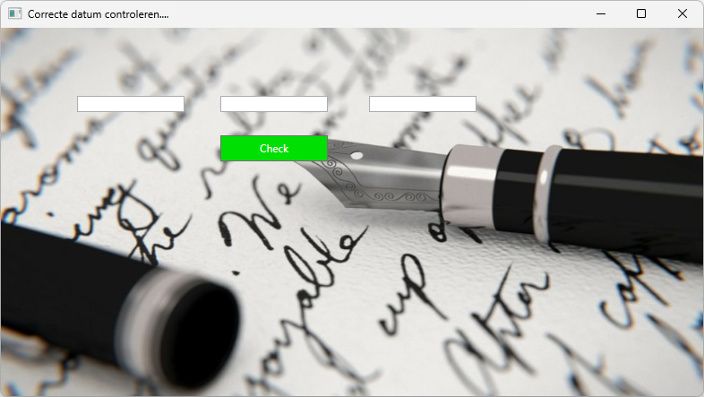
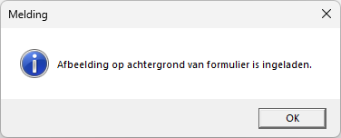
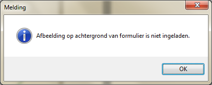
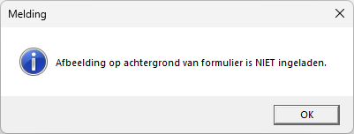
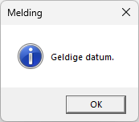
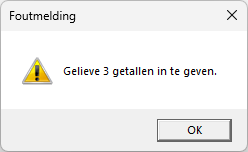
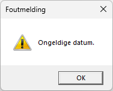

# Oefening 4: TryCatchDatum

De toepassing moet een correcte datum controleren, maar ook een controle
uitvoeren op het correct inladen van een achtergrondafbeeling bij het
laden van het formulier.

Zorg eerst voor een ***gestructureerde foutafhandeling*** bij het
inladen van een achtergrondafbeelding van je formulier. Geef een melding
of het inladen van de afbeelding gelukt is of niet.

*Geen fout bij het laden van het formulier*

*Fout bij inladen*

Maak gebruik van een gestructureerde foutafhankelijk wanneer een
foutieve datum ingevoerd wordt. Ofwel wordt een verkeerde datum
ingegeven (Vb. 5/13/2024) ofwel wordt een fout gemaakt bij het invoeren
van een datum ( Vb. 5/m/2024).

Melding bij geldige ingave

*Boodschappen bij ongeldige ingaven.*

